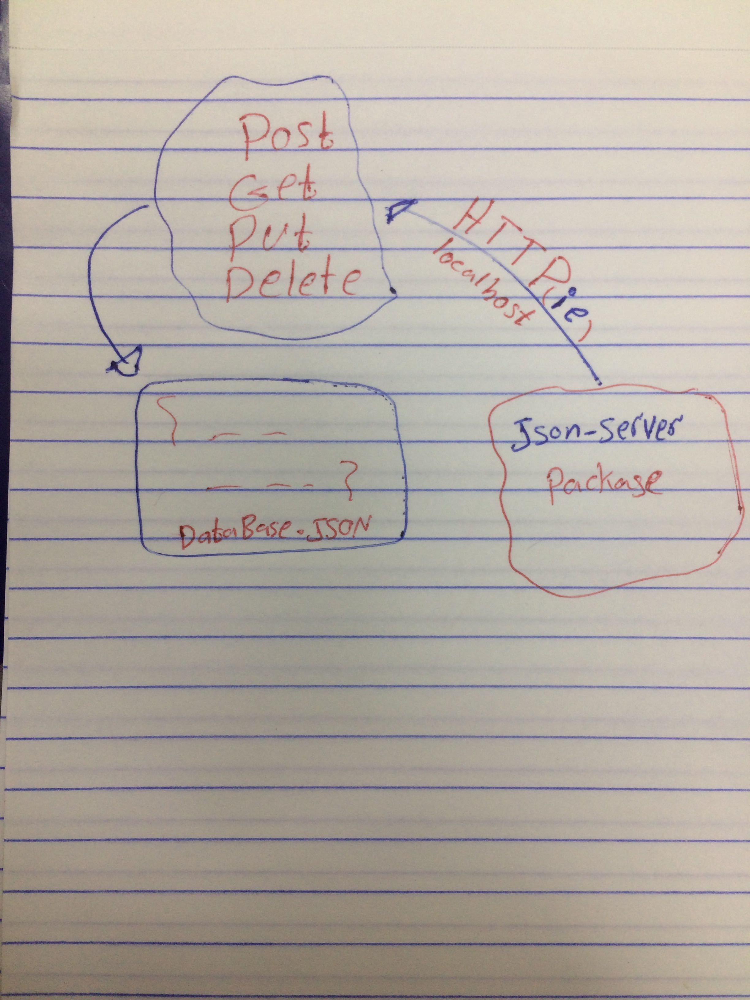

# LAB - Class 06

## HTTP and REST

### Author: Saja Swalgah

### Links and Resources

- [submission PR](http://xyz.com)
- [swagger hub page ](https://app.swaggerhub.com/apis/SajaSwalgah/class-06/0.1) 

### Setup
PORT = 3000

#### How to initialize/run your application (where applicable)

- json-server
- json-server --id=_id --watch ./data/db.json --routes routes.json

#### Tests

- How do you run tests?
   json-server --id=_id --watch ./data/db.json --routes routes.json

#### UML

